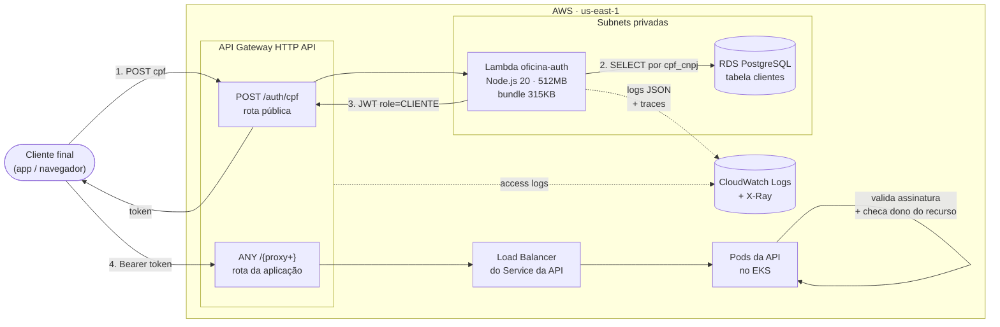
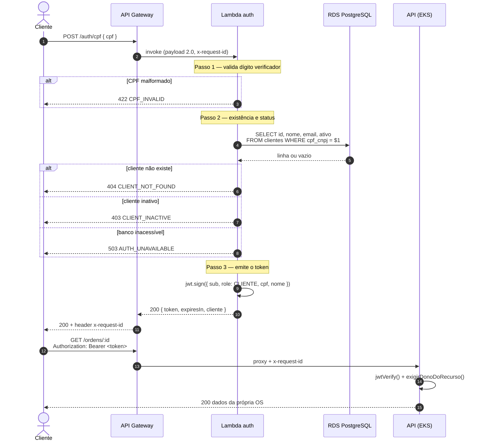

# oficina-auth-lambda

**Function serverless de autenticação por CPF** e **API Gateway** da Oficina Mecânica.
Repositório 1 de 4 do Tech Challenge — Fase 3.

Este repositório entrega os dois componentes que passam a ficar na frente de toda a
plataforma: a função que autentica o cliente final pelo CPF e emite o JWT, e o
gateway que é o ponto único de entrada — roteando `/auth/cpf` para a função e todo o
resto para a API que roda no EKS.

| Repositório | Papel |
| --- | --- |
| **oficina-auth-lambda** (este) | Function serverless de autenticação por CPF + API Gateway |
| [oficina-infra-k8s](https://github.com/Xikin/oficina-infra-k8s) | VPC + cluster EKS + metrics-server |
| [oficina-infra-db](https://github.com/Xikin/oficina-infra-db) | RDS PostgreSQL gerenciado |
| [oficina-mvp](https://github.com/Xikin/tech_challenge) | Aplicação principal executando no cluster |

---

## Arquitetura desta stack



### Fluxo de autenticação — diagrama de sequência



### Decisões que valem explicar

**`pg` em vez de Prisma.** O Prisma Client com o engine nativo passa de 40 MB; o
bundle desta função tem **315 KB**, o que mantém o cold start em ~300ms. A Lambda faz
uma única consulta de leitura — não precisa de ORM. O schema continua sendo
propriedade da API, que é quem roda `prisma migrate deploy`.

**Pool no escopo do módulo.** O `Pool` do `pg` é criado fora do handler, então
invocações quentes reaproveitam a conexão TCP e o handshake TLS: ~300ms na primeira,
~15ms nas seguintes. `max: 1` porque cada container atende uma invocação por vez e o
`db.t3.micro` tem teto baixo de conexões.

**404 e 403 são respostas diferentes.** O requisito pede "consultar a existência **e
o status**" — cliente inexistente devolve 404, cliente inativo devolve 403. Colapsar
os dois num só código perderia a distinção que o enunciado pede.

**Só CPF, sem CNPJ.** O validador da API aceita CPF ou CNPJ; aqui o ramo de CNPJ foi
deliberadamente removido, e a consulta filtra `tipo_pessoa = 'FISICA'`. Autenticação
de pessoa física não deve aceitar documento de pessoa jurídica.

**CPF nunca aparece em log.** `mascararCPF` reduz para `***.***.247-25` antes de
qualquer linha de log, e o corpo da resposta devolve apenas `id` e `nome` do cliente.

**Segredo próprio, não o da API.** A função assina com `JWT_CLIENTE_SECRET`, diferente do
`JWT_SECRET` do login interno, e a API só aceita deste emissor tokens com `role: CLIENTE`.
Quem obtiver a configuração desta função consegue, no máximo, se passar por um cliente —
nunca por um administrador ([ADR-0011](https://github.com/Xikin/tech_challenge/blob/main/docs/adr/0011-segredos-jwt-por-emissor.md)).

**Concorrência reservada.** A função tem teto de 10 execuções simultâneas
(`lambda_reserved_concurrency`). Sem ele, uma força bruta de CPF escalaria até o limite da
conta e esgotaria as conexões do RDS, derrubando a API junto.

**Segredos por variável de ambiente.** Ver
[ADR-0006](docs/adr/0006-segredos-da-lambda.md) — a subnet privada não tem NAT nem
VPC Endpoint, então ler o Secrets Manager em runtime seria impossível sem custo fixo
adicional.

---

## Tecnologias

| Camada | Tecnologia |
| --- | --- |
| Runtime | Node.js 20 (ESM), TypeScript 5.6 |
| Bundle | esbuild — artefato único de ~315 KB |
| Banco | `pg` (node-postgres) contra RDS PostgreSQL |
| Token | `jsonwebtoken` (HS256), compatível com `@fastify/jwt` da API |
| Gateway | AWS API Gateway **HTTP API** (v2) |
| IaC | Terraform ~> 1.10, backend S3 |
| Testes | Vitest — 24 testes, cobertura mínima de 80% |
| Observabilidade | Logs JSON + AWS X-Ray + access logs do gateway |

---

## Contrato da API

### `POST /auth/cpf`

```jsonc
// requisição
{ "cpf": "529.982.247-25" }   // aceita com ou sem máscara
```

```jsonc
// 200 OK
{
  "token": "eyJhbGciOiJIUzI1NiIs...",
  "expiresIn": "8h",
  "cliente": { "id": "uuid", "nome": "Ana Souza" }
}
```

| Status | `code` | Quando |
| --- | --- | --- |
| 200 | — | CPF válido, cliente existe e está ativo |
| 400 | `INVALID_BODY` | corpo não é JSON |
| 400 | `CPF_REQUIRED` | campo `cpf` ausente ou vazio |
| 422 | `CPF_INVALID` | dígito verificador não confere |
| 404 | `CLIENT_NOT_FOUND` | CPF válido, mas sem cadastro |
| 403 | `CLIENT_INACTIVE` | cliente existe, porém inativo |
| 500 | `MISCONFIGURED` | `JWT_CLIENTE_SECRET` ausente na função |
| 503 | `AUTH_UNAVAILABLE` | RDS inacessível ou timeout |

Toda resposta — inclusive as de erro — devolve o header `x-request-id` para
correlação com os logs.

### Payload do JWT

```jsonc
{
  "sub": "uuid-do-cliente",
  "role": "CLIENTE",
  "cpf": "52998224725",
  "nome": "Ana Souza",
  "email": "ana@example.com",   // omitido quando o cliente não tem e-mail
  "iss": "oficina-auth-lambda",
  "iat": 1757462400,
  "exp": 1757491200
}
```

### Swagger / Postman

A especificação completa da plataforma (esta rota e todas as da aplicação) está em
[oficina-mvp](https://github.com/Xikin/tech_challenge):

- Swagger UI: `<API_GATEWAY_URL>/docs`
- OpenAPI: [`docs/openapi.json`](https://github.com/Xikin/tech_challenge/blob/main/docs/openapi.json)
- Collection Postman: [`postman/`](https://github.com/Xikin/tech_challenge/blob/main/postman)

---

## Execução local

```bash
npm ci
npm test          # 24 testes, sem precisar de AWS nem banco
npm run typecheck
npm run package   # gera lambda.zip
```

Os testes fazem mock do módulo de banco, então rodam offline.

---

## Deploy

> **Ordem obrigatória.** Esta é a **última** stack a subir: ela lê do SSM as subnets
> privadas (`oficina-infra-k8s`), o security group e a `DATABASE_URL`
> (`oficina-infra-db`) e o endereço do Load Balancer (`oficina-mvp`). O pipeline
> verifica os quatro parâmetros antes de aplicar e falha com mensagem explícita se
> algum faltar.

```
oficina-infra-k8s  ->  oficina-infra-db  ->  oficina-mvp  ->  oficina-auth-lambda
```

```bash
npm run package

cd terraform
terraform init \
  -backend-config="bucket=oficina-tfstate-<ACCOUNT_ID>" \
  -backend-config="region=us-east-1" \
  -backend-config="key=auth-lambda/prod/terraform.tfstate"

export TF_VAR_jwt_cliente_secret='<o MESMO JWT_CLIENTE_SECRET da API>'
terraform apply

terraform output -raw exemplo_curl
```

### Deploy automático

| Gatilho | O que acontece |
| --- | --- |
| PR para `main` ou `homolog` | `format:check` + `typecheck` + testes + empacotamento |
| Push em `homolog` | tudo acima + `terraform apply` em homologação + smoke test |
| Push em `main` | tudo acima + `terraform apply` em produção + smoke test |
| `workflow_dispatch` com `destroy` | `terraform destroy` do ambiente da branch |

O smoke test envia um CPF inválido ao ambiente recém-publicado e exige HTTP 422 —
prova que gateway e função estão de pé sem depender de haver cliente no banco.

### Secrets necessários no repositório

| Secret | Origem |
| --- | --- |
| `AWS_ACCESS_KEY_ID` | Learner Lab → AWS Details → AWS CLI |
| `AWS_SECRET_ACCESS_KEY` | idem |
| `AWS_SESSION_TOKEN` | idem — **expira a cada 4h** |
| `TF_STATE_BUCKET` | `oficina-infra-k8s/bootstrap/backend.sh` |
| `JWT_CLIENTE_SECRET` | **exatamente o mesmo** `JWT_CLIENTE_SECRET` da API — nunca o `JWT_SECRET` dela |

> Se o `JWT_CLIENTE_SECRET` divergir entre esta função e a API, o token é emitido com
> sucesso e **rejeitado silenciosamente** na primeira rota protegida. É a falha mais
> difícil de diagnosticar neste projeto.

---

## Observabilidade

| Sinal | Onde |
| --- | --- |
| Logs estruturados JSON | CloudWatch `/aws/lambda/oficina-<env>-auth` |
| Access logs do gateway | CloudWatch `/aws/apigateway/oficina-<env>` |
| Traces | AWS X-Ray (`tracing_config` ativo) |
| Latência, erros, cold start | Métricas nativas da Lambda e do API Gateway |

Todas as linhas carregam `requestId` (o `awsRequestId`) e `correlationId` (o
`x-request-id` propagado), o que permite seguir uma requisição do gateway até o log
da aplicação no cluster.

```bash
aws logs tail /aws/lambda/oficina-prod-auth --follow --format short
```

## Documentação

- [Notas de implementação](docs/notas-de-implementacao.md) — o porquê das escolhas do código e da configuração, por arquivo
- [ADR-0006 — Segredos injetados no deploy](docs/adr/0006-segredos-da-lambda.md)
- [RFC-0003 — Estratégia de autenticação por CPF](https://github.com/Xikin/tech_challenge/blob/main/docs/rfc/0003-estrategia-de-autenticacao.md)
- [Documentação de arquitetura consolidada](https://github.com/Xikin/tech_challenge/blob/main/docs/arquitetura.md)
